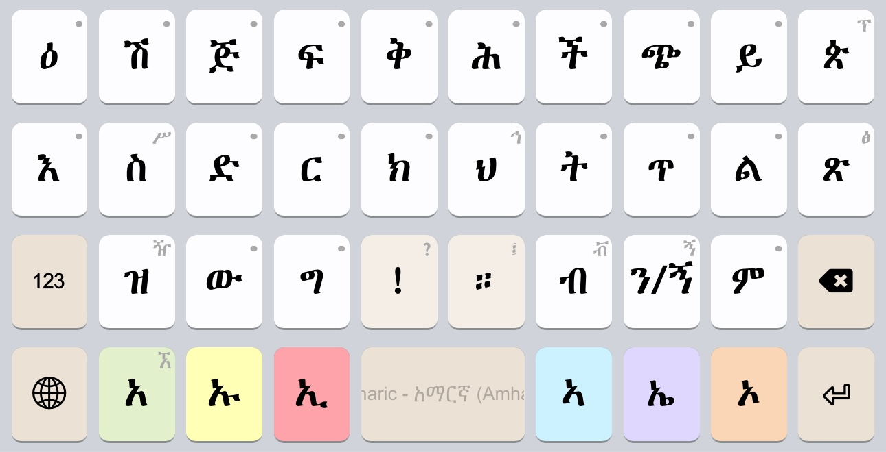
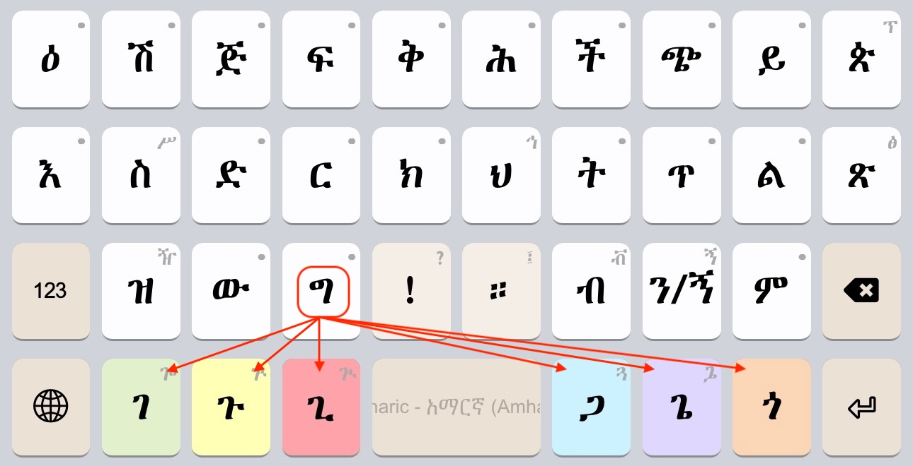
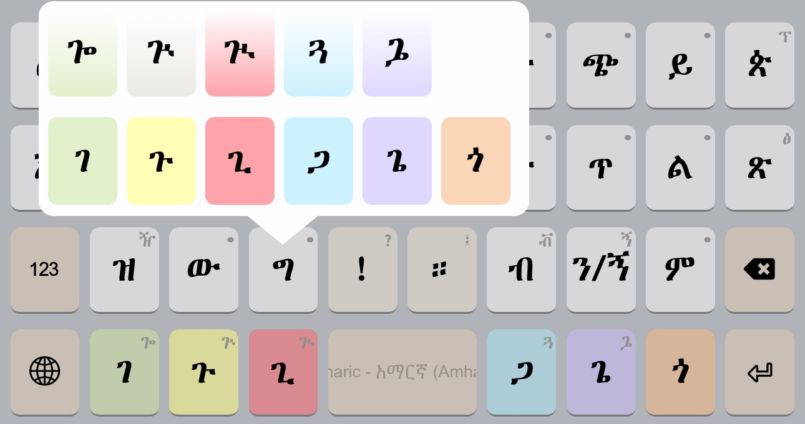
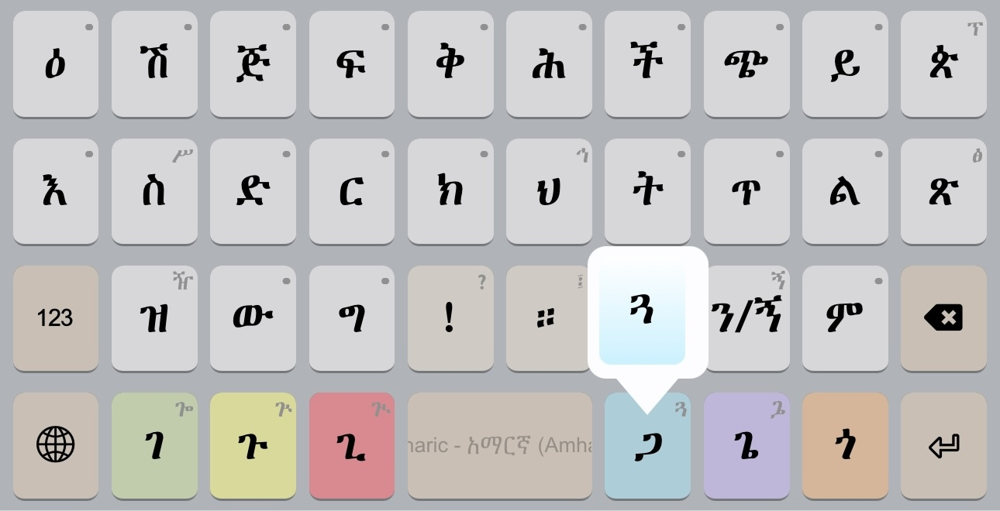
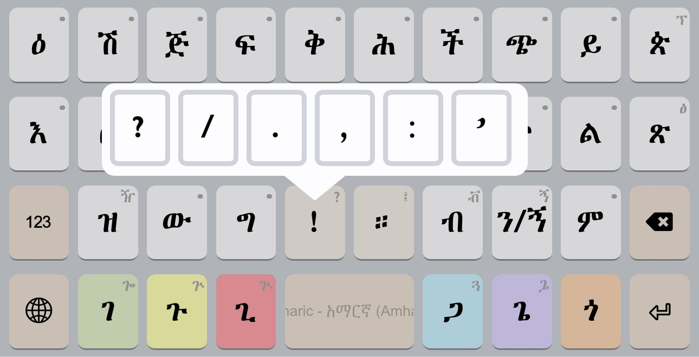
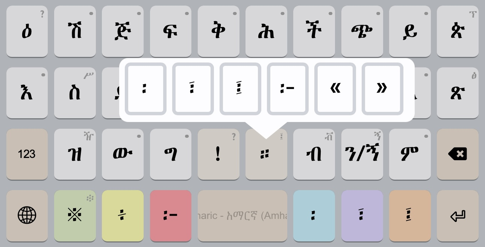
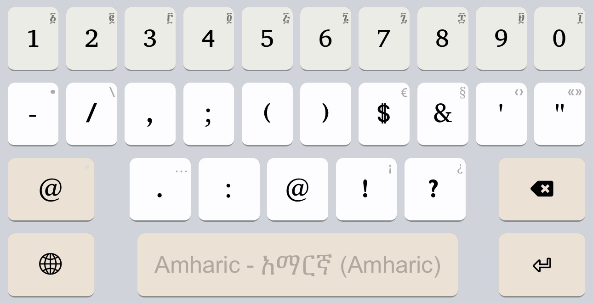
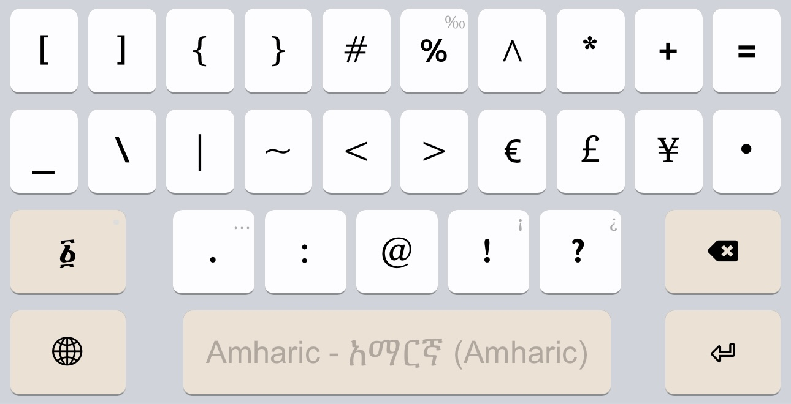
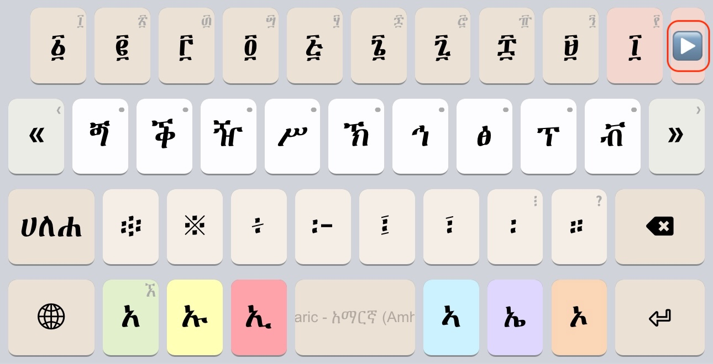
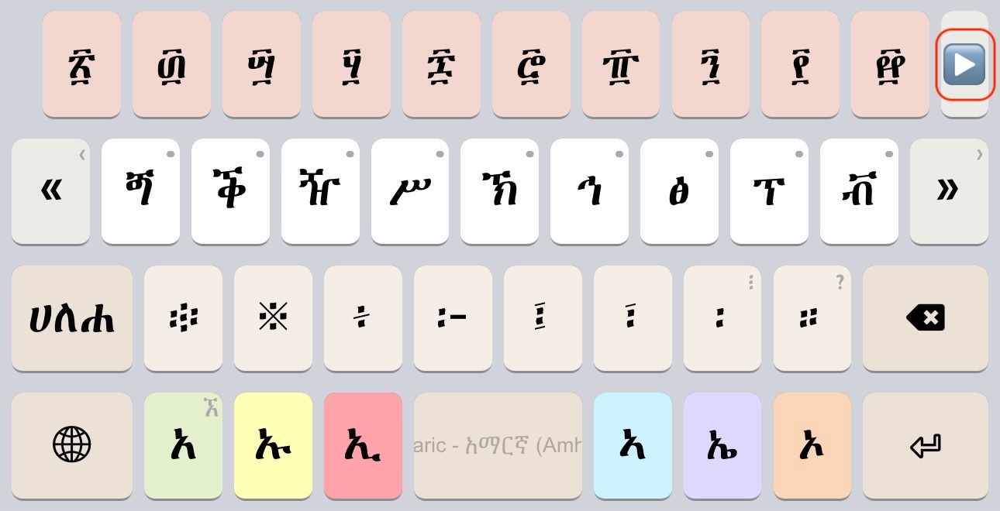

# አማርኛ (Amharic) Keyboard

Copyright (C) 1997-2023 Geʾez Frontier Foundation, SIL International

Version 3.1.1

This is an Amharic (amh, አማርኛ) language mnemonic input method.  It requires a font supporting
Ethiopic script under the Unicode 14 standard.

## Links

 * Home:     <http://keyman.com/amharic>
 * Deployed: <http://keyman.com/keyboards/gff_amharic>
 * Help:     <http://help.keyman.com/keyboard/gff_amharic>
 * Contact:  <support@keyman.com>
 * Specification :  http://keyboards.ethiopic.org/specification/
 * Other Info    :  http://keyboards.ethiopic.org/ , http://unicode.org/charts/

# Supported Platforms

 | Desktop | Mobile | Tablet | Other |
 |---------|--------|--------|-------|
 |<ul><li>Windows</li><li>macOS</li><li>Linux</li></ul>|<ul><li>iPhone</li><li>Android</li></ul>|<ul><li>iPad</li><li>Android</li></ul>|<ul><li>Web</li></ul>|

## Mobile Layout &amp; Layers

### Default

When the GFF Amharic mobile keyboard starts, the key layout appears as shown in the following image.  Note the relationship between the letters of the middle row and top row:

Tapping a key once, the modifier letters to the left (`አ`, `ኡ`, `ኢ` ) and right  (`ኣ`, `ኤ`, `ኦ`) of the spacebar. For example, tapping `ግ` the modifiers change to `ገ`, `ጉ`, `ጊ`, `ጋ`, `ጌ`, `ጎ` .  If a modifier is tapped, ግ will be updated on screen and replaced with the selected letter.

As an alternative, if preferred, holding a key down for a few moments (called a "longpress") a popup menu appears where you can tap the letter desired.  The popup menu for `ግ` is shown below:

The modifier keys will also have popups as applicable.  For example to enter the extended syllables for `ጐ`, `ጒ`, `ጓ`, `ጔ` and `ጕ` as shown:

### Punctuation

When typing letters, the `!` and `።` keys are available for entering the most common punctuation without shifting to another "layer".  The following image shows the punctuation for a longpress of `!`:

The punctuation for a longpress of `።`:

For additional punctuation and numerals, tap the `123` key to shift to the next layer:

Note that numerals on the punctuation layer use the long press feature to make Geʾez numerals available:

Tapping the `@` key shifts to a 2nd layer to access all remaining punctuation:

A tap of the `፩` key will go to the final layer where Geʾez numbers and some less used, and non-Amharic letters, can be accessed.

### Numerals

The last layer to shift to presents the Geʾez numbers, all Geʾez punctuation, letters of related languages, and a few lesser used letters that did not fit conveniently on the initial letters layer.

Note the arrow button, `▶`, at the end of the row of Geʾez numerals, tapping it will slide the numerals to the remaining numbers that are orders of ten (e.g. ፳, ፴, ፵, etc.):

After tapping the `▶` button, the Geʾez orders of ten appear as shown:

Tapping the `▶` button again slides to the western digits, a final tap will return to the initial Geʾez numerals.

Simply tap the `ሀለሐ` key to return to the starting letters layers.
