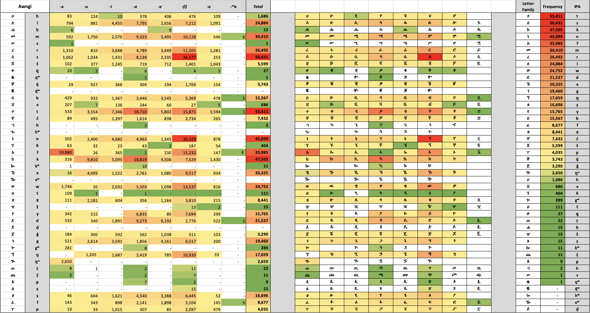
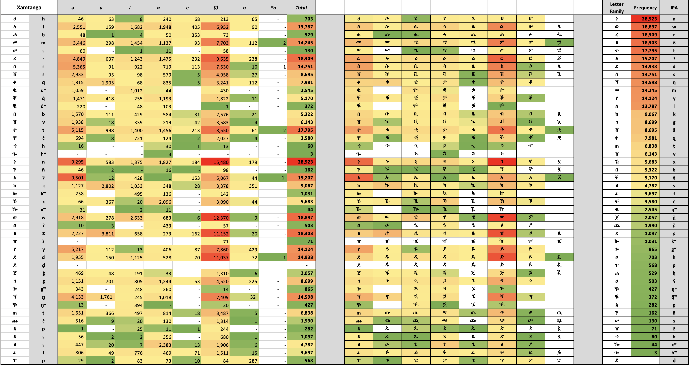

# Orthography Notes
The Awngi & Xamtanga (aka Khimtanga) touch keyboards have been informed by the letter frequencies of the online Awngi and Xamtanga language newspapers, ቺርቤዋ and ኽምጠ ዊክ respectively. These newspaper archives also form the respective corpora for the companion predictive text [dictionaries](https://github.com/keymanapp/lexical-models). The [PrimerPrep](https://software.sil.org/primerprep/) tool is used to produce the lexicons.  Word letter frequency counts are then produced from the word frequencies counts of the lexicons.

In the lexicons extracted for both languages, words with a frequency count less than "10" have been elided.  These low frequency terms are likely to reflect spelling errors and, when valid, have a low probability of being utlized in predictive text. The letter frequencies, with notes, are presented in the following sections.

## Awngi (አዊ)
The Awngi corpus used to derive letter frequencies comes from the archives of the [ቺርቤዋ (Chirbeiwa) newspaper.](https://www.amharaweb.com/category/%e1%89%ba%e1%88%ad%e1%89%a4%e1%8b%8b/). The letter frequency counts are then tabulated in the following heatmaps:

## Xamtanga (ኽምጣጘ, Khimtanga)

The Xamtanga corpus used to derive letter frequencies comes from the archives of the 
[ኽምጠ ዊክ (Khimte Week)](https://www.amharaweb.com/category/%e1%8a%bd%e1%88%9d%e1%8c%a0-%e1%8b%8a%e1%8a%a8/). The letter frequency counts are then tabulated in the following heatmaps:

The orthography in the Khimta Week newspaper uses some slightly different conventions than as seen in the Khimtanga New Testament,
[ኽምጣጘ - ኣይር ኪዳን ](https://www.bible.com/ur/bible/3182/MAT.1.%E1%8A%BD%E1%88%9D%E1%8C%A3%E1%8A%A3%E1%8A%AA).  Where, as can be seen in the title, the use of the 4th order Aleph-A vowel `ኣ`  is preferred over the 1st order `አ`.  The distinction can be viewed as the Khimtanga NT follows Tigrinya conventions, while Khimta Week (as well as Chirbeiwa) use Amharic practices. The diffence between the two conventions for Khimtanga will be investigated and may impact a future version of the keyboard.