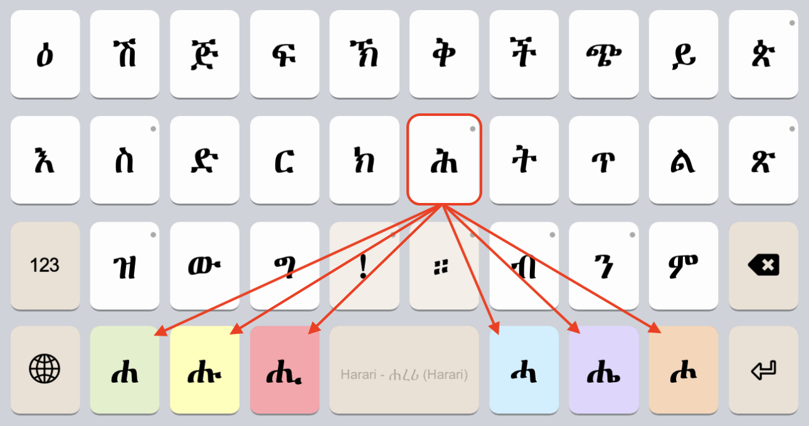
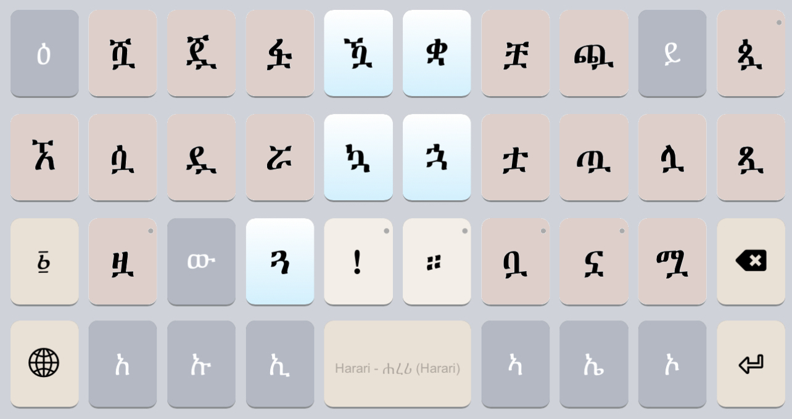
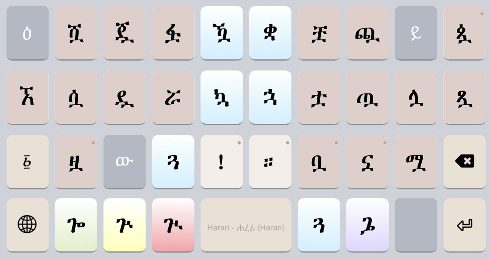
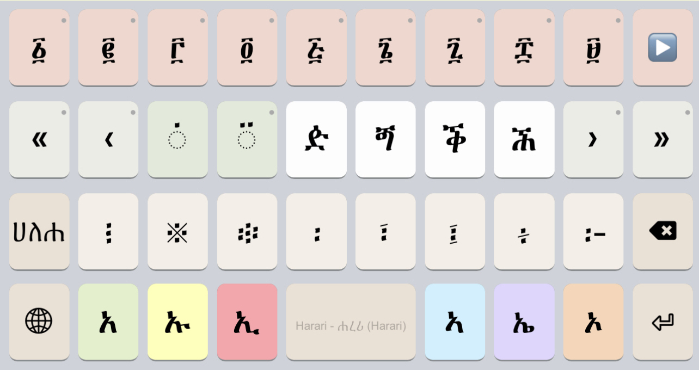
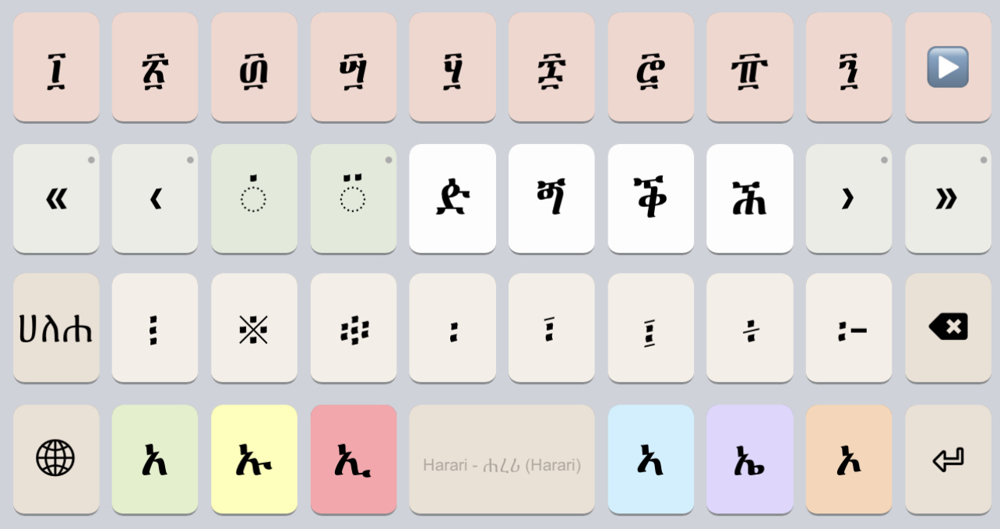
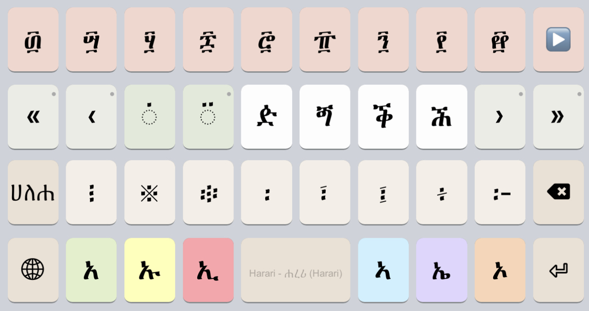

# ሐረሪ (Harari) Keyboard

Copyright © 2023 Geʾez Frontier Foundation, SIL International

Version 1.0.4

This is an Harari (har, ሐረሪ) language mnemonic input method.  It requires a font supporting
Ethiopic script under the Unicode 3.0 standard for typing Harari, and Unicode 14 for typing
related languages.

## Links

 * Home:     <http://keyman.com/harari>
 * Deployed: <http://keyman.com/keyboards/gff_harari>
 * Help:     <http://help.keyman.com/keyboard/gff_harari>
 * Contact:  <support@keyman.com>
 * Specification :  http://keyboards.ethiopic.org/specification/
 * Other Info    :  http://keyboards.ethiopic.org/ , http://unicode.org/charts/

# Supported Platforms

 | Desktop | Mobile | Tablet | Other |
 |---------|--------|--------|-------|
 |<ul><li>Windows</li><li>macOS</li><li>Linux</li></ul>|<ul><li>iPhone</li><li>Android</li></ul>|<ul><li>iPad</li><li>Android</li></ul>|<ul><li>Web</li></ul>|

## Mobile Layout &amp; Layers

### Default

When the GFF Harari mobile keyboard starts, the key layout appears as shown in the following image.  Note the relationship between the letters of the middle row and top row:

Tapping a key once, the modifier letters to the left (`አ`, `ኡ`, `ኢ` ) and right  (`ኣ`, `ኤ`, `ኦ`) of the spacebar will update. For example, tapping `ሕ` the modifiers change to `ሐ`, `ሑ`, `ሒ`, `ሓ`, `ሔ`, `ሖ` .  If any modifier key is tapped, ሕ will be updated on screen and replaced with the selected letter.

When a key has a `·` symbol in the top-right corner, it indicates that more options are available. Holding a key with a `·` down for a few moments (called a “longpress”) a popup menu appears where you can tap a letter or puncutation that appears.  The popup menu for `ን` is shown below:

Tapping `ኝ` will then update the modifier keys so that `ኘ`, `ኙ`, `ኚ`, etc. appear for selection. By this approach, `ኝ` was on a "hidden" or "extra" key. This approach is used to make additional letters, numbers, and punctuation available that did not fit onto the present keyboard “layer”.

### Punctuation

When typing letters, the `!` and `።` keys are available for entering the most common punctuation without shifting to another "layer".  The following image shows the punctuation for a longpress of `!`:

The punctuation for a longpress of `።`:

For additional punctuation and numerals, tap the `123` key to shift to the next layer:

Note that numerals on the punctuation layer use the long press approach to make Geʾez numerals available:

Tapping the `@` key shifts to a 2nd layer to access all remaining punctuation:

A tap of the `፩` key will go to the final layer where Geʾez numbers and some less used, and non-Harari letters, can be accessed.

### Extra -wa Letters

Tapping the `ሏሟሷ` key shifts to the next layer which presents all 8th order and higher letters with a “wa” sound that are occassionally needed for words of other languages.

Most letters have only a single extra “wa” form that can be typed directly.  Blue shaded keys indicate letters that have the full five additional “wa” syllables.  Tapping the `ጓ` key, for example, the modifier keys will update to offer the five “wa” syllables as shown:

### Numerals

The last layer to shift to presents the Geʾez numbers, all Geʾez punctuation, and letters of related languages that did not fit conveniently on the initial letters layer.

Note the arrow button, `▶`, at the end of the row of Geʾez numerals, tapping it will slide the numerals to the orders of ten (e.g. ፳, ፴, ፵, etc.):

The Geʾez orders of ten appear as shown after the `▶` button is tapped:

Tapping the `▶` button again slides to display the last two numerals, and a final tap will return to the initial Geʾez numerals.

Finally, simply tap the `ሀለሐ` key to return to the starting letters layers.
