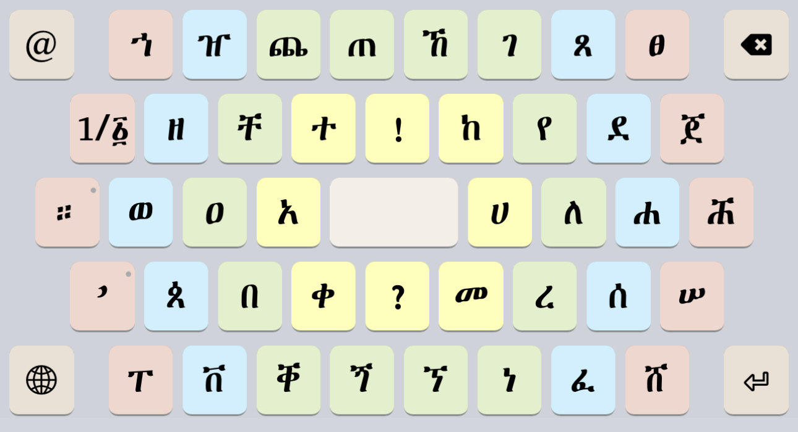
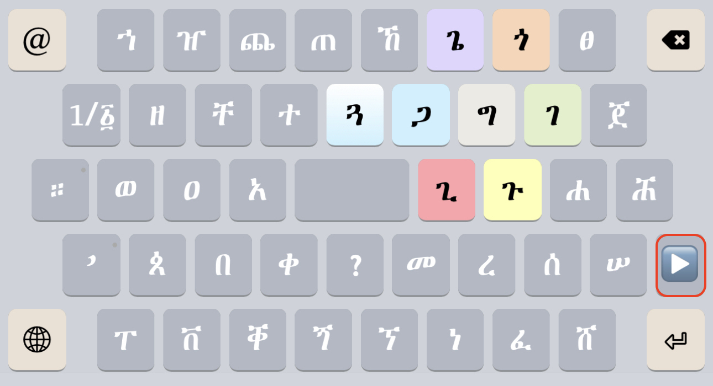
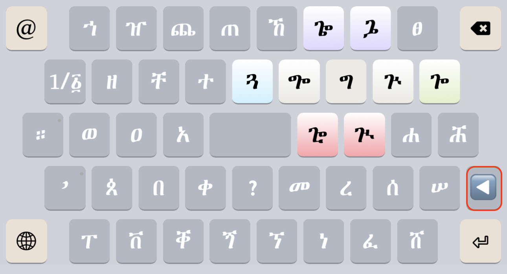
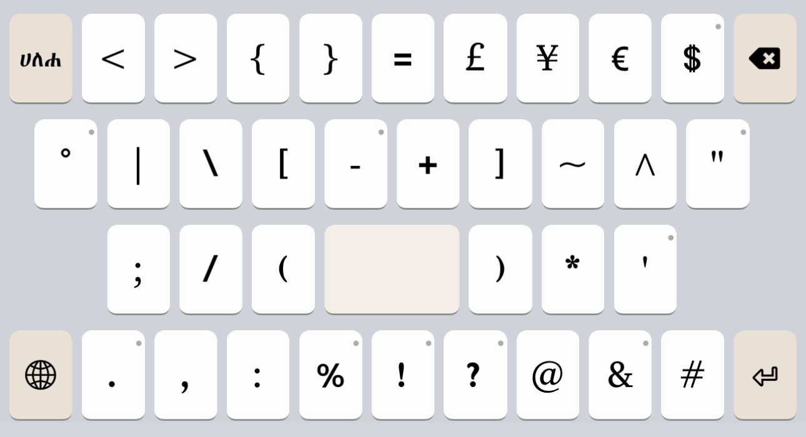
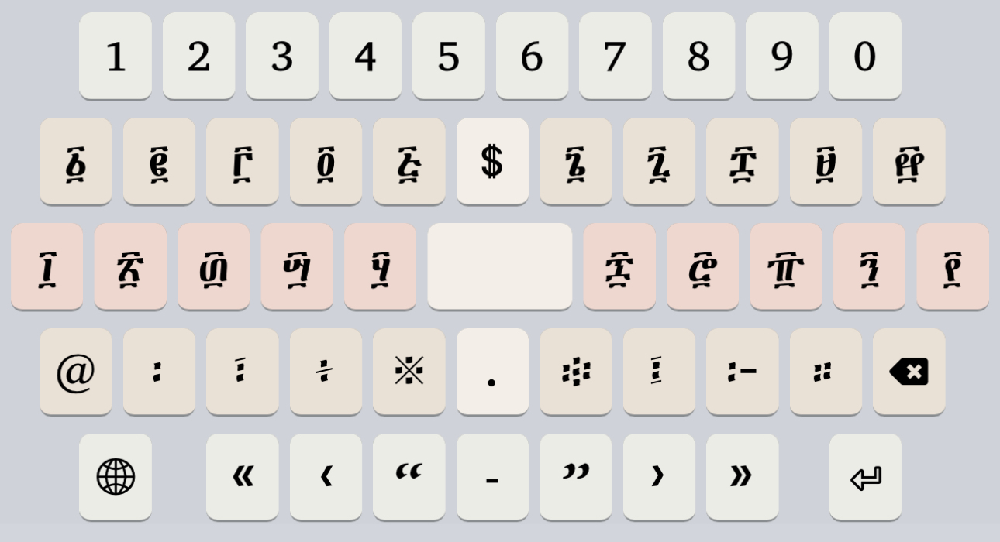

# Harege Fidelat (ሐረገ ፊደላት) Keyboard

Copyright © 2022-2023 Geʾez Frontier Foundation

Version 1.1

This is a language-neutral touch (only) keyboard for mobile devices. The keyboard provides all Ethiopic letters in active use on a single layer in a circular, semi-clockwise orientation. It is meant to be intuitive for new typists but supports faster typing for experienced typists compared to the similar [Mesobe Fidelat Keyboard](https://github.com/keymanapp/keyboards/tree/master/release/gff/gff_mesobe_fidelat) keyboard.

## Links

 * Home:     <http://ethiopic.keymankeyboards.com>
 * Deployed: <http://keyman.com/keyboards/gff_harege_fidelat>
 * Help:     <http://help.keyman.com/keyboard/gff_harege_fidelat>
 * Contact:  <support@keyman.com>
 * Specification :  http://keyboards.ethiopic.org/specification/
 * Other Info    :  http://keyboards.ethiopic.org/ , http://unicode.org/charts/

## Supported Platforms

 * iOS
 * Android
 * Tablet

## Keyboard Layers

The mobile keyboard uses the “Mesob” style layout of letters where letters are arranged in a series of 4 rings.  Modifier keys that will change the vowel of a letter appear dynamically on screen in selection “Halos”. 

The Mesob layout also has the goal of providing *all* letters actively used b the languages written with Geʾez script in a single keyboard “layer”. Given the high number of letters appearing on the keyboard, it is a better fit for larger size mobile phones.   Consider using the more compact [GFF Amharic Keyboard](https://github.com/keymanapp/keyboards/tree/master/release/gff/gff_amharic) for regular sized mobile phones.

### Letters

The most frequently used letters generally appear in inner rings, and less used letters appear in the out rings. Letters are arranged in a semi-alphabetic arrangement in the clockwise direction, but not strictly so.  Some effort is made to group related letters together (related either by sound or shape).

Tapping a key once enters it on to the screen in the 6th (ሳድስ) form and a “halo” appears on the keyboard of the related letters. Tapping a related letter will update the first letter, or tap the 6th letter again to go back to the starting keyboard. 

Note the highlighted arrow button, `▶`, above the Enter key, it will appear for large families of related letters.  When you need them, the `▶` button will bring up a 2nd halo of letters that are used less frequently. Note the reverse `◀` botton which will go back to the first halo.

### Punctuation

On the letter keyboards, the `።` and `’` keys are the use popup menus to offer the most frequently used punctuation that did not fit easily on the keyboard.  Tap the `@` key to access all available Western punctuation as shown:

### Numbers

Tap the `1/፩` key on the letter keyboards to shift to numerals. The numerals layer presents the Western numbers, Geʾez numbers, and all Geʾez punctuation.

