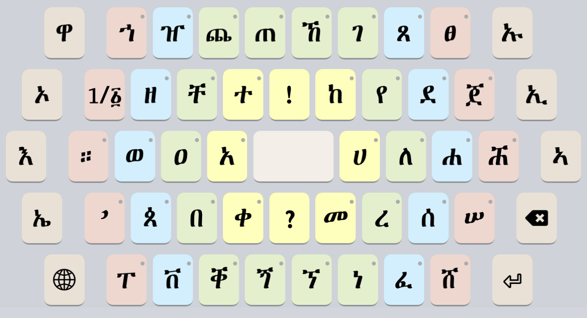

# Mesobe Fidelat (መሶበ ፊደላት) Keyboard

Copyright © 2022-2023 Geʾez Frontier Foundation

Version 1.1

This is a language-neutral touch (only) keyboard for mobile devices. The keyboard provides all Ethiopic letters in active use on a single layer in a circular, semi-clockwise orientation. It is meant to be intuitive for new typists and fits more comfortably on a tablet device than on a mobile phone.

## Links

 * Home:     <http://ethiopic.keymankeyboards.com>
 * Deployed: <http://keyman.com/keyboards/gff_mesobe_fidelat>
 * Help:     <http://help.keyman.com/keyboard/gff_mesobe_fidelat>
 * Contact:  <support@keyman.com>
 * Specification :  http://keyboards.ethiopic.org/specification/
 * Other Info    :  http://keyboards.ethiopic.org/ , http://unicode.org/charts/

## Supported Platforms

 * iOS
 * Android
 * Tablet

## Mobile Layout &amp; Layers

The mobile keyboard uses the “Mesob” style layout of letters where letters are arranged in a series of 4 rings.  Modifier keys that will change the vowel of a letter appear in the outer most ring. 

The Mesob layout also has the goal of providing *all* letters actively used by the languages written with Geʾez script in a single keyboard “layer”. Given the high number of letters appearing on the keyboard, it is a better fit for tablet devices than for typical mobile phones. Consider using the more compact [Harege Fidelat Keyboard](https://github.com/keymanapp/keyboards/tree/master/release/gff/gff_harege_fidelat) which is a similar design and fits more comfortably on the smaller mobile phone screens.
 
### Letters

The most frequently used letters generally appear in the inner rings, and less used letters appear in the out rings. Letter are arranged in a semi-alphabetic arrangement in the clockwise direction, but not strictly so.  Some effort is made to group related letters together (related either by sound or shape).

Tapping a key once, the modifier letters on the left (`ኡ`, `ኢ` `ኣ`,) and right  (`ኤ`, `ኦ`, `ዋ`) of the outer ring will update. For example, tapping `ገ`, the modifiers change to `ጉ`, `ጊ`, `ጋ`, `ጌ`, `ጎ` and  `ጓ`.  If a modifier is tapped, ገ will be updated on screen and replaced with the selected letter.

 

Note how the `ዋ` key changes to `ጓ`.  Tapping the `ጓ` key repeatedly will update `ጓ` on the screen to the related syllables: 
 `ጐ`, `ጒ`, `ጔ` and `ጕ`. 

As an alternative, if preferred, holding a key down for a few moments (called a “longpress”) a popup menu appears where you can tap the letter desired.  The popup menu for `ግ` is shown below:

 

Like the letter keys, the `።` and `’` keys also have popup menus that offer the most frequently used punctuation.

### Numerals

Tap the `1/፩` key to shift to the numerals layer. The numerals layer presents the Western numbers, Geʾez numbers, and all Geʾez punctuation.

Tapping the `@` shifts to a 3rd layer to access all remaining punctuation:

### Punctuation

Punctuation is distributed over two layers on mobile phones, and appears on a single layer on tablets where more screen space is available. The first punctuation layer provides the most frequently used set of symbols:

Tapping the `#+€` key shifts to a final layer to access all remaining punctuation:

 

Simply tap the `ሀለሐ` key to return to the Mesob letters layers.

## Tablet Layout &amp; Layers

The Mesob tablet layout is *identical* to the mobile phone layout with the exception that a single punctuation layer is used. The single takes advantage of the greater screen space available.  The larger punctuation layer is shown in the following image:

