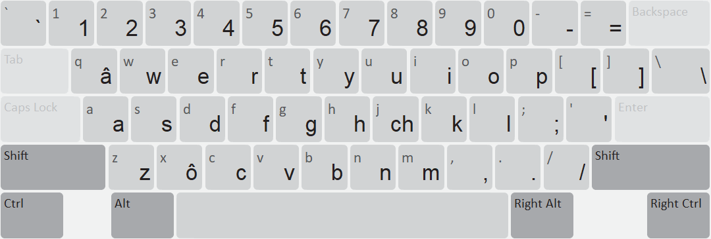
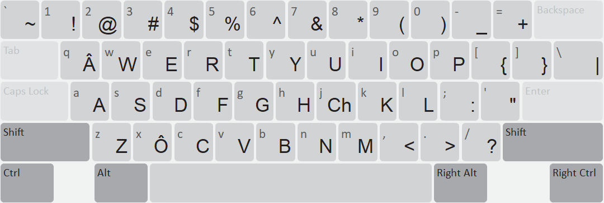
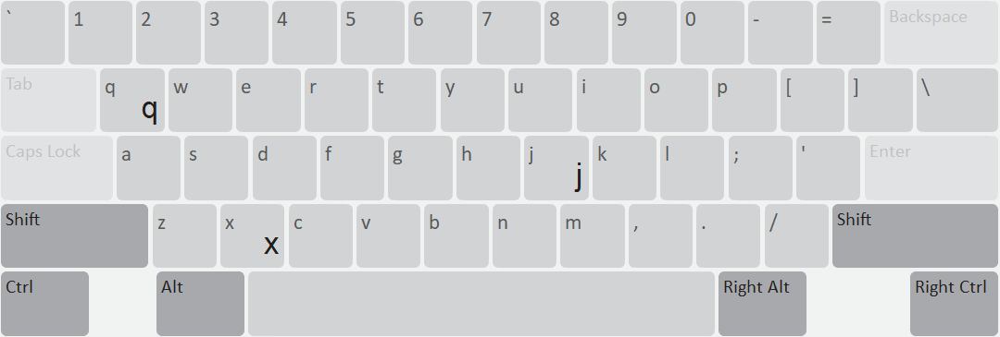
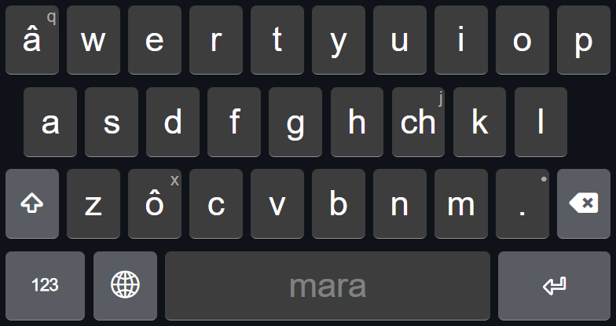
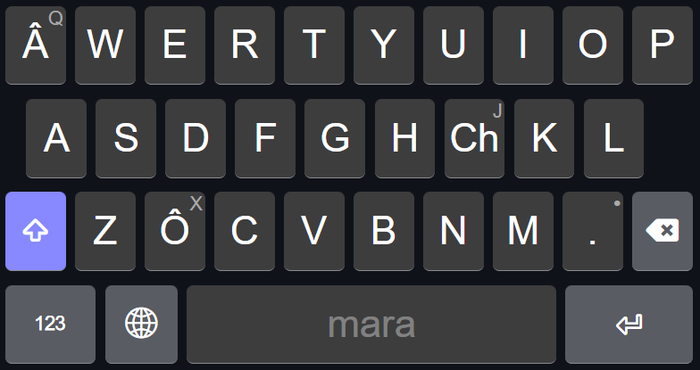
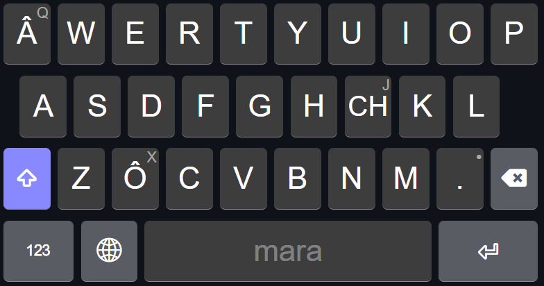

# Mara Keyboard

This keyboard is for the Mara language.

## Description

The Mara Keyboard is designed for the Mara people to type easily in their language.

The Mara Keyboard is based on the standard English (QWERTY) layout, but includes special characters for the Mara language.

*   The **Q** key has been replaced with **Â** (unshifted **â**).
*   The **X** key has been replaced with **Ô** (unshifted **ô**).
*   The **J** key produces the digraph **Ch**.
    *   Press **j** for **ch**
    *   Press **Shift** + **j** for **Ch**
    *   Turn on **Caps Lock** and press **j** for **CH**

### Typing Original English Letters

If you need to type the original English **q**, **x**, or **j**, you can use the **Right Alt (AltGr)** key:

*   **Right Alt** + **q** = **q** (Hold Shift for **Q**)
*   **Right Alt** + **x** = **x** (Hold Shift for **X**)
*   **Right Alt** + **j** = **j** (Hold Shift for **J**)

### Smart Backspace (Step-Wise Backspacing)

The keyboard features smart, step-wise backspacing for circumflex characters. Pressing **Backspace** immediately after typing **â**, **Â**, **ô**, or **Ô** will only delete the circumflex (**^**) and leave the base letter intact. Pressing it a second time will delete the base letter.

This allows for easy typing of the Mara alphabet while retaining access to standard English letters. The rest of the keys follow the standard QWERTY layout.

The touch layout for phones follows a similar pattern, with the special characters readily available on the main keyboard layer.

## Palâsana

Mara Kibaw he Marasawzy ta âmo reih hmâpa ta châ ama chhuh thei nawpa ta pachhuahpa a châ.

Mara Kibaw he English (QWERTY) layout hmâpa ta pachhuahpa châ ta, Mara reihchâ liata hawhrawh eihpazy: `â`, `ô`, nata `ch` zy he pahlaopa a châ.

*   **Q** key he **Â** (unshifted **â**) ta thlapa a châ.
*   **X** key he **Ô** (unshifted **ô**) ta thlapa a châ.
*   **J** key liata **Ch** he thlapa a châ.
    *   **j** key he **ch**
    *   **Shift** + **j** key he **Ch**
    *   **Caps Lock** On nota **j** key he **CH**

### Monyuh Hawhrawh Chhuhna

Monyuh hawhrawh **q**, **x**, nata **j** zy chhuh nawpa ta, **Right Alt (AltGr)** key hmâ theipa a châ:

*   **Right Alt** + **q** = **q** (**Q** châta Shift)
*   **Right Alt** + **x** = **x** (**X** châta Shift)
*   **Right Alt** + **j** = **j** (**J** châta Shift)

### Smart Backspace (Step-Wise Backspacing)

He keyboard liata smart backspace khôpa a châ. **â**, **Â**, **ô**, nata **Ô** na chhuh tawhta **Backspace** na hmie khiahta, luhkhu (**^**) he rao tua aw ta, hawhrawh pizy a y ha chy aw. Backspace na hmie heih khiahta cha a hawhrawh pizy a rao aw.

He he Mara châhnawh chhuhna a pahlâ nawpa châta ta pachhuahpa a châ. Key hropazy cha QWERTY layout a ypa hawhta a y.

Phone châta touch layout chhao he hawhna heta pachhuahpa châ ta, Mara reihchâ hnawh eih viapazy chhao main keyboard liana he hmâ thei awpa ta a y.

## Links

* Keyboard Homepage: [https://keyman.com/keyboards/mara](https://keyman.com/keyboards/mara)

## Author

This keyboard was created by [Laitei](https://laitei.dev).

## Copyright

See [LICENSE.md](LICENSE.md) for copyright information.

## Supported Platforms

*   Windows
*   macOS
*   Linux
*   Web
*   iPhone
*   iPad
*   Android phone
*   Android tablet

## Keyboard Layout

### Desktop

**Default (Unshifted)**

**Shifted**

**Right Alt (AltGr)**

**Shift + Right Alt**

### Touch

**Default (Unshifted)**

**Shifted**

**Caps Lock**

