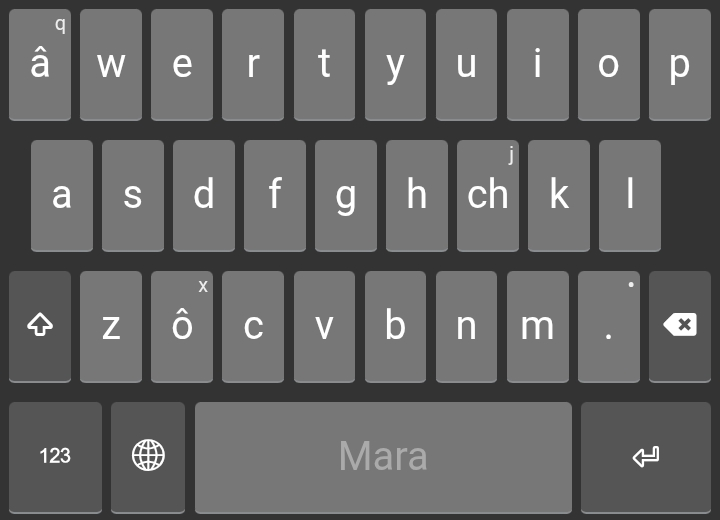
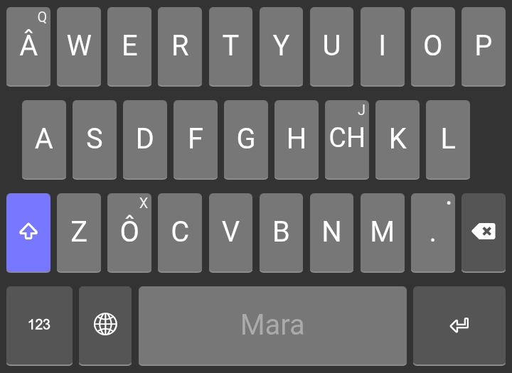

# Mara Keyboard

This keyboard is for the Mara language.

## Description

The Mara Keyboard is designed for the Mara people to type easily in their language.

The Mara Keyboard is based on the standard English (QWERTY) layout, but includes special characters for the Mara language.

*   The **Q** key has been replaced with **Â** (unshifted **â**).
*   The **X** key has been replaced with **Ô** (unshifted **ô**).
*   The **J** key produces the digraph **CH** (unshifted **ch**).

This allows for easy typing of the Mara alphabet. The rest of the keys follow the standard QWERTY layout.

The touch layout for phones follows a similar pattern, with the special characters readily available on the main keyboard layer.

## Palâsana

Mara Keyboard he Mara pho zy ta âmo reih hmâpa ta chhuh awpa ta pachhuahpa a châ.

Mara Keyboard he English (QWERTY) layout hmâpa ta pachhuahpa châ ta, Mara reihchâ liata hawhrawh eihpa ta `â`, `ô`, `ch` zy pahlaopa a châ.

*   **Q** key he **Â** (unshifted **â**) ta thla pa a châ.
*   **X** key he **Ô** (unshifted **ô**) ta thla pa a châ.
*   **J** key chata **CH** (unshifted **ch**) a taopa.

He he Mara châhnawh chhuhna a palâ nawpa châta ta pachhuahpa a châ. Key hropa zy cha QWERTY layout a ypa hawhta a y.

Phone châta touch layout chhao he hawhna heta pachhuahpa châ ta, Mara reihchâ hnawh eih viapazy chhao main keyboard liana he hmâ thei awpa ta a y.

## Links

* Keyboard Homepage: [https://keyman.com/keyboards/mara](https://keyman.com/keyboards/mara)

## Author

This keyboard was created by Laitei.

## Copyright

See [LICENSE.md](LICENSE.md) for copyright information.

## Supported Platforms

*   Windows
*   macOS
*   Linux
*   Web
*   iPhone
*   iPad
*   Android phone
*   Android tablet

## Keyboard Layout

### Desktop

**Unshifted**

**Shifted**

### Touch

**Unshifted**

**Shifted**

